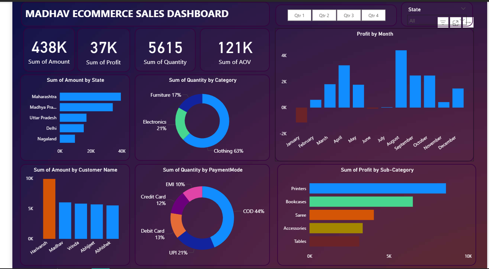

# MADHAV-E-COMMERCE-SALES-DASHBOARD
This project showcases an interactive Power BI dashboard that analyzes e-commerce sales performance. It highlights key metrics such as sales, profit, quantity, customer behavior, product categories, payment modes, and monthly trends, helping stakeholders make informed, data-driven business decisions.

# Introduction
In today’s competitive e-commerce landscape, data-driven decision-making is essential for business growth. Organizations need clear visibility into their sales performance, customer behavior, and product profitability.
This project uses Power BI to transform raw sales data into a visually appealing dashboard that provides a 360-degree view of business performance.
## Key focus areas include:
- Revenue and profit analysis
- Customer purchasing trends
- Product category and sub-category insights
- State-level performance
- Payment mode preference
- Monthly profit trends
- KPIs to monitor business growth
## Project Objectives
- To analyze overall sales performance using key performance indicators (KPIs).
- To identify high-performing and low-performing products and categories.
- To understand customer buying patterns based on amount spent and quantity purchased.
- To analyze payment mode distribution and customer preferences.
- To visualize sales and profit distribution across states.
- To provide data-driven recommendations for business improvement.
### Tools & Technologies Used
- Power BI Desktop – Data modeling, DAX, visualization
- Microsoft Excel – Data cleaning and preparation
- Power Query – Data transformation
- DAX Measures – KPI calculations (Amount, Profit, Quantity, AOV)
### Data Cleaning & Preparation
- Removed duplicate transactions
- Standardized customer names, product categories, and sub-categories
- Validated state names
  #### Created calculated measures:
- Sum of Amount
- Sum of Profit
- Sum of Quantity
- Average Order Value (AOV)
- Added a date hierarchy for month and quarter analysis
- Applied data modeling and relationship creation (fact and dimension tables)
## Dashboard Features

[Interact with the live Dashbaord here](https://app.powerbi.com/groups/me/reports/60e76bed-6d68-48da-92c5-ec6ec580e63c/5bdd99cb22c2ddaea566?experience=power-bi)
#### The dashboard includes:
✔️ Key Metrics (KPIs)
- 438K – Total Sales Amount
- 37K – Total Profit
- 5615 – Total Quantity Sold
- 121K – Average Order Value (AOV)
## Insights & Analysis
### 1. Sales Performance
- The business generated 438 a total sales amount.
- Profit recorded was 37K, which indicates a reasonable margin depending on business size.
### 2. Performance by State
Top-performing states:
- Maharashtra – highest sales
- Madhya Pradesh – strong performance
- Uttar Pradesh, Delhi, and Nagaland contributed moderately.
#### This suggests the west and central regions drive most of the revenue.
### 3. Product Category Insights
- Clothing dominates the business with 63% of total quantity sold.
- Electronics: 21%
- Furniture: 17%
#### Clothing is the best-selling and most popular category.
### 4. Sub-Category Profitability
Top profitable sub-categories:
- Printers – highest profit
- Bookcases
- Saree, Accessories, and Tables follow
#### Electronics-related subcategories (e.g., printers) provide better profit margins.
### 5. Customer Insights
- Harivansh is the highest-paying customer.
- Customers like Madhav, Vrinda, Abhijeet, and Abhishek follow with moderate purchases.
#### This suggests recurring customers drive consistent revenue.
### 6. Payment Mode Analysis
Payment preferences:
- Cash on Delivery (COD): 44% – most preferred
- UPI: 21%
- Debit Card: 13%
- Credit Card: 12%
- EMI: 10%
#### High COD usage shows customers trust delivery before payment.
### 7. Monthly Profit Trend
- Profit peaked significantly in August, followed by high activity in March and April.
- February and July recorded low or negative profit.
#### This reveals seasonality patterns and operational opportunities.
### 8. Business Implications
From the insights:
- Clothing is the best-selling category → should be prioritized in stock planning.
- Printers and electronics accessories yield high profit → ideal for promotional campaigns.
- COD dominance means customers value trust → improving delivery speed can boost revenue.
- States like Maharashtra and Madhya Pradesh are strong markets → can be targeted more.
- Low-profit months need deeper investigation (discount issues, high costs, etc.).
### 9. Conclusion
The dashboard provides a comprehensive view of Madhav E-commerce’s performance. It highlights the strongest markets, best-selling categories, profitable sub-categories, and customer behaviors.
By using Power BI, complex data was transformed into actionable insights that help decision-makers focus on strategic growth areas.
### 10. Recommendations
- Increase Stock & Promotions for Clothing
Since it contributes 63% of sales, ensure constant availability and offer periodic discounts.
- Expand High-Profit Categories
Printers and electronics accessories are highly profitable — more marketing investment should be made in this area.
- Strengthen Presence in Top States
##### Focus marketing campaigns on states like:
    - Maharashtra
    - Madhya Pradesh
    - Uttar Pradesh
- Improve Delivery Service
### With 44% COD users, improving delivery reliability can convert COD customers into prepaid buyers.
- Investigate Negative Profit Months
### Analyze February and July to identify:
    - High returns
    - High operational cost
    - Pricing issues
    - Discount mismanagement
- Customer Retention Strategy
### Reward top customers with:
- Loyalty discounts
- Personalized emails
- Exclusive offers

## 👨‍💻 Author
### Folagbade Olatunbosun Samuel
- 💼 LinkedIn:https://www.linkedin.com/in/olatunbosun-folagbade-559151243/
- 📧 Email:Folagbadeolatunbosun@gmail.com

